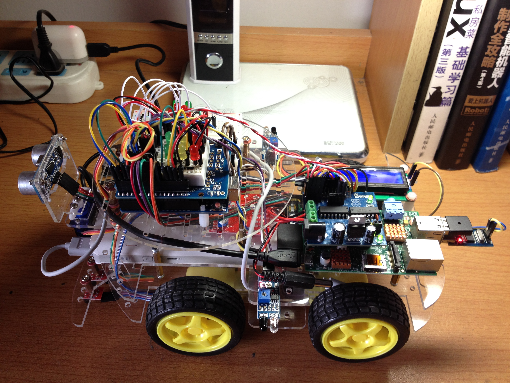
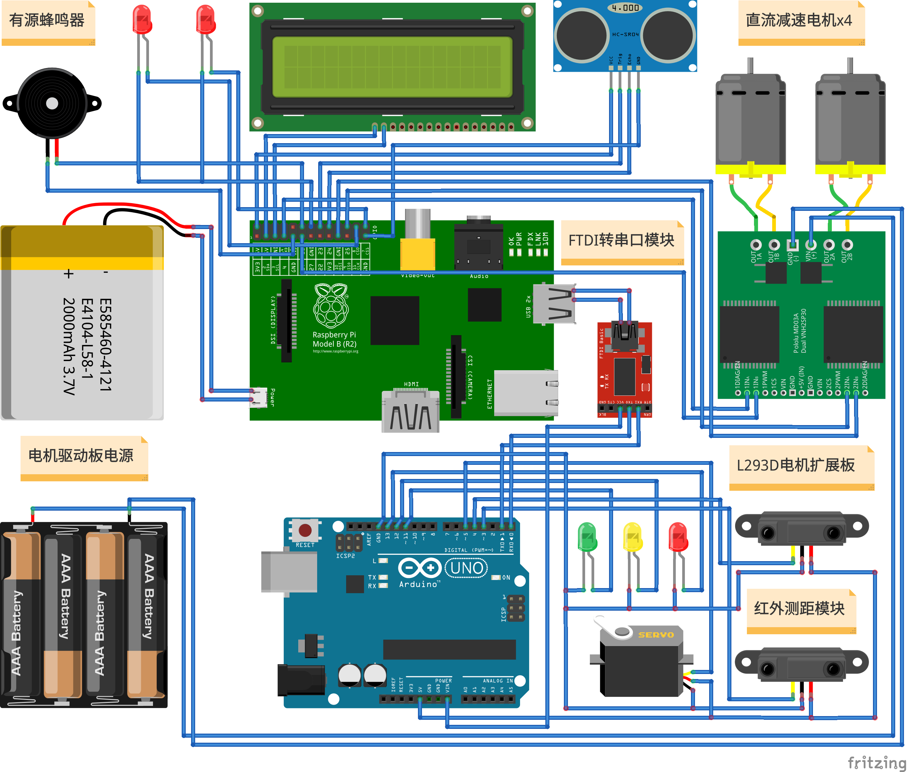

# simple_wheeled_robot



## Description

This project is what I did in the freshman year in the university, using arduino and raspberry pi boards to implement a simple mobile car. It can achieve the functions are: remote control, obstacle avoidance and ranging.

## Principle



## Video

The following video show the basic function of the [simple_wheeled_robot)](https://www.bilibili.com/video/BV19J411Q79D).

## Configure

1. Please connect lines correctly.
2. Download **simple_wheeled_robot.ino** program to the arduino.
3. Start the raspberry pi, switch directory to Desktop, and use follow command to get codes.

  ```sh
  $> cd Desktop
  $> git clone https://github.com/myyerrol/simple_wheeled_robot.git
  ```

4. Set autostart and reboot raspberry pi to enjoy!

  ```sh
  $> mkdir /home/pi/.config/autostart
  $> cd ../.config/autostart
  $> cp ../Desktop/simple_wheeled_robot/config/simple_wheeled_robot.desktop ./
  $> sudo reboot
  ```

## Summary

By finishing this project, I learned simple python programming, sensors programming, and using of arduino and raspberry pi boards, ect. Although this car's function is very limited, I still enjoyed that happiness when I made the car run! I believe I can do better on the road of maker in the future!
